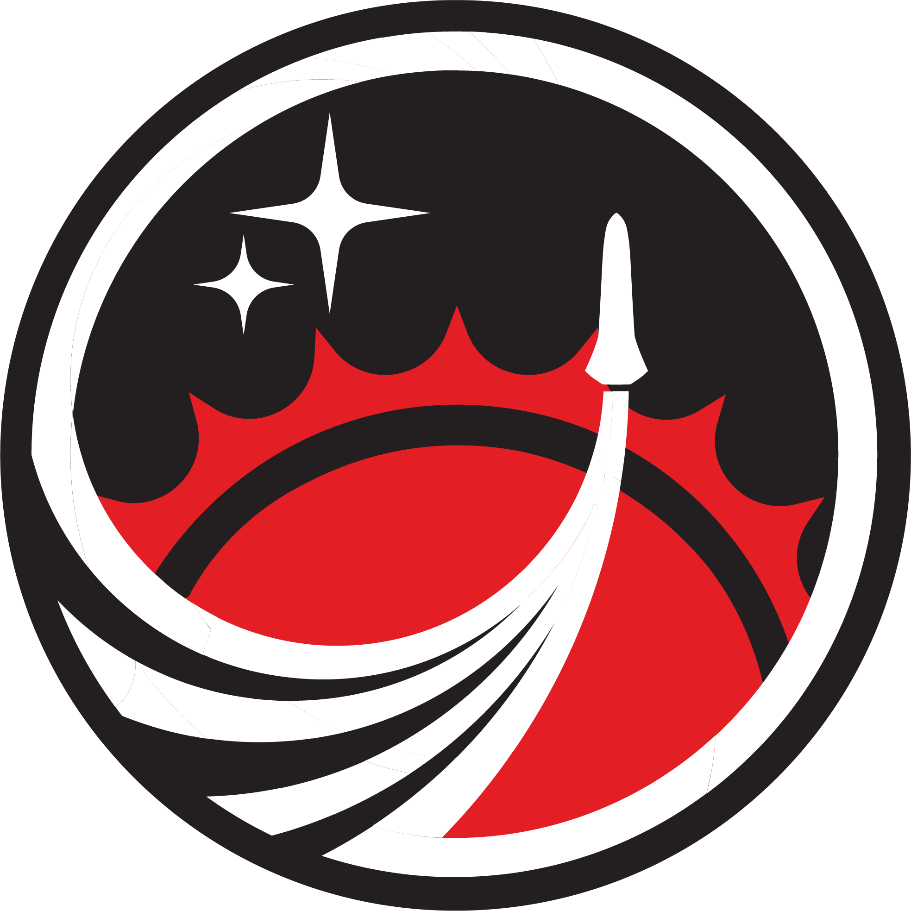

# Solaris Uvigo Aerotech

## Welcome to Solaris Uvigo Aerotech!

We're glad you're here!

At Solaris Software we believe that software should not be a limitation for a team to compete. That is why our software is free to use with a [CC BY-NC-SA creative commons license](https://creativecommons.org/cc-licenses/). What this means:

- Credit must be given to UVigo Aerotech Solaris, the creator.

- Only noncommercial use of our work is permitted. Noncommercial means not primarily intended for or directed towards commercial advantage or monetary compensation. We do this to avoid our software to be used in military or any kind of business advantage. We want our code to be free to use and free of charge without causing harm to others.

- Adaptations must be shared under the same terms.

We want all the teams and people around the globe to collaborate on our project. Join us to make a better software!

