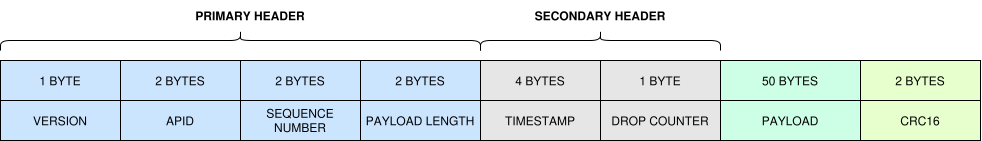

A Solaris packet is made up of a primary header, a secondary header, a payload, and a CRC-16.

{ .center }

## Primary header (7 bytes)

- **Version** (1 byte) — the SPP protocol version currently in use, as defined in `version.h`.
- **APID** (2 bytes) — identifies which service produced the packet. The APID is assigned by the PUBSUB service when a producer registers.
- **Sequence number** (2 bytes) — incremented on every packet a producer sends. It lets ground control detect a packet lost in transport, over the air.
- **Payload length** (2 bytes).

## Secondary header (5 bytes)

- **Timestamp** (4 bytes) — either the time since power-up, or the time received from the GNSS service.
- **Drop counter** (1 byte) — incremented whenever a packet had to be dropped because of an error.

## Payload and CRC

The remaining 52 bytes are a 50-byte payload followed by a 2-byte CRC-16:

```
 7 (primary header) + 5 (secondary header) + 50 (payload) + 2 (CRC) = 64 bytes
```

The fixed 64-byte size is deliberate: it keeps the packet aligned with the buffer sizes most boards already use internally.

This layout is adapted from the ECSS Space Packet Protocol standard — an unrelated specification that happens to share the same acronym, SPP, with Solaris Packet Protocol.

An optional encryption block can wrap the full packet. That is covered separately, and does not change anything described here — it has no effect on `packet.h` or its layout.

A packet like this is never allocated on the fly — there is no dynamic memory in this codebase. You borrow one from a fixed-size pool instead, which is exactly what the Databank chapter, next, is about.
