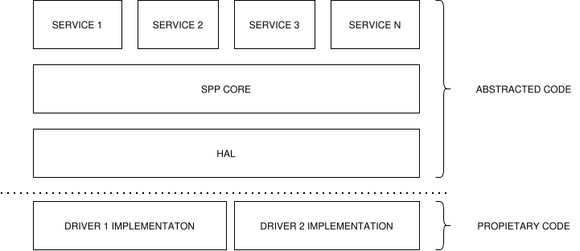

# General Layer Description
Solaris Software is built in layers. Each layer does not know the existance of the layers below or above. You can switch or cange layers contents without affecting the functionality of the code. This is shown in the image below.




### HAL layer
The lowest layer is called HAL or Hardware Abstraction Layer. This layer is the one responsible to talk with the hardware of the board. This includes all the functions such as SPI, UART, Clocks, I2C, etc. If you need to talk to hardware, the layer will be the place where you will find the functions needed. 
As an interesting concept, since the HAL pertains to the "abstracted code", it does not implement functionality. For example, in the HAL layer you will find a function like this one:

```
/**
 * @brief Perform a full-duplex SPI transaction.
 *
 * @param[in,out] p_handle  SPI device handle.
 * @param[in,out] p_data    TX data in, RX data out (in-place).
 * @param[in]     length    Number of bytes in the transaction.
 *
 * @return K_SPP_OK on success, K_SPP_ERROR_ON_SPI_TRANSACTION on failure.
 */
SPP_RetVal_t SPP_HAL_SPI_transmit(void *p_handle, spp_uint8_t *p_data, spp_uint8_t length);
```

This function is responsible for sending an SPI transaction, located at: solaris-packet-protocol/hal/spi/spi.h. But if you go into the implementation...you will be greatly disapointed, because you will find something like this:

```
SPP_RetVal_t SPP_HAL_SPI_transmit(void *p_handle, spp_uint8_t *p_data, spp_uint8_t length)
{
    SPP_RetVal_t ret = K_SPP_ERROR;

    const SPP_HalPort_t *p_port = SPP_HAL_getPort();
    if ((p_port == NULL) || (p_port->spi.spiTransmit == NULL))
    {
        ret = K_SPP_ERROR_NULL_POINTER;
    }
    else
    {
        ret = p_port->spi.spiTransmit(p_handle, p_data, length);
        if (ret != K_SPP_OK)
        {
            ret = K_SPP_ERROR;
        }
    }
    return ret;
}
```

As you can see, we don't call any function of any custom board, but rather a function pointer __p_port->spi.spiTransmit(p_handle, p_data, length);__. This is what makes the abstraction great. We make our HAL independent of the platform. Later on, when detailing the HAL, we will explain how to set it up and how to modify it.

### SPP Core layer
The SPP Core layer contains basic functonality for the SPP to work. This includes some compulssory services such as the databank, packet generation, crc, pubsub service,.... We will see later on all of its parts. This is the core and should always be included in the final binary file.

### Services layer
Above the core we have the service layer. This is tought as the "app store". Developers can create and validate independent modules and the plug them into the core to make them run. There are two types of services in SPP. Consumers of data and producers of data. They both have a "contract" that they follow. This will be explained more in detail later. You can have as many services as you whish, but this can mean a higher control cycle time. In a rocket, we normally don't have that many services, but in a bigger system you have to take this into account. The more amount of service you have, more time it will take your control cycle.

### Driver implementations
Lastly we have the drivers. This is the part that is implemented based on the platform you are using. Here is where the function pointer we saw earlier, will be implemented. It is the function it will be called with the function pointer above.
You can have an implementation fo driver for each board SDK (Software Development Kit). For each platform, you need to develop the drivers or implement them according to the SPP function signatures in the HAL. This is a bit cumbersome, but it should not take much and you can reuse all the software in very few weeks. As an example, we are currently modifying our software to have support for both the ESP32S3 and the RP2350 boards. So you will find implementations for both. This can serve you as inspiration. It can also happen we have not tought correctly on this abstraction and that we missed something. In that case, let us know to fix it right away!


And that's it! Well, it is a bit more complex, that is why the documenation is long, but with this entry you should get the main idea. As you saw, there is no OSAL (Operating System Abstraction Layer) because we do it all baremetal, for a good amount of reasons, and one of them is control on the execution.
